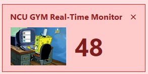
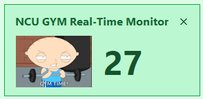
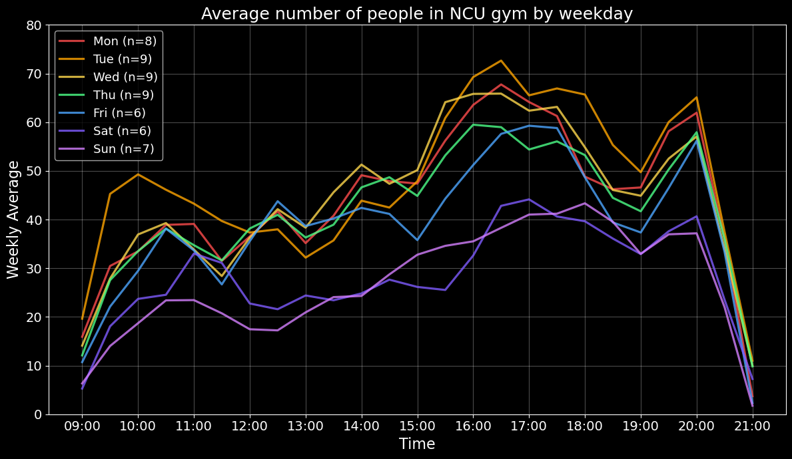

# NCU GYM Real-Time Monitor

> Walked all the way to the gym just to discover every bench is occupied?  
> Yeah... same here.

So instead of repeatedly opening the NCU gym occupancy website before every workout, I made a small desktop widget that lives on my screen and constantly monitors the gym crowd level for me.

Now I can instantly know whether:

- it's finally chest-day time,
- maybe I should wait a bit,
- or I should just stay in the lab and pretend to do research.

---

## Preview

### Desktop Widget

The widget changes its color theme and GIF animation based on the current gym occupancy.

<p align="center">
  
  <br>
  <em>High occupancy mode</em>
</p>

<p align="center">
  
  <br>
  <em>Medium occupancy mode</em>
</p>

---

## What is this?

This project is a lightweight real-time desktop widget for monitoring the occupancy of the National Central University (NCU) gym weight room.

The widget:

- fetches real-time occupancy data from the NCU sports center website,
- displays it directly on your desktop,
- changes colors based on crowd level,
- and reacts with different GIFs depending on how painful the gym situation currently is.

Think of it as:

- part productivity tool,
- part gym survival system,
- part procrastination side project.

---

## Features

### Real-Time Desktop Widget

- Always-on-top floating widget
- Draggable frameless window
- Apple-widget / trading-dashboard inspired UI
- Real-time occupancy updates
- Dynamic color themes

### Smart Occupancy Alerts

Customizable crowd thresholds:

- 🟢 Low occupancy → GO NOW
- 🟠 Medium occupancy → maybe acceptable
- 🔴 High occupancy → stay in the lab

The widget also:

- changes GIF animations dynamically,
- flashes when the gym is relatively empty,
- and gives emotional support during peak hours.

---

## Quick Start

Clone this repository:

```bash
git clone <your_repo_url>
```

Install required packages:

```bash
pip install pandas matplotlib requests beautifulsoup4 pillow
```

Then simply run:

```bash
gym.pyw
```

and the widget should appear directly on your desktop.

---

## Project Structure

```text
.
├── gym.pyw                     # Real-time desktop widget
├── gif/                        # GIF animations used by the widget
│   ├── gymtime.gif
│   ├── blueguy.gif
│   └── usingcomputer.gif
├── gym_count/                  # Historical occupancy records
│   ├── gym_count_2026-03-22.csv
│   ├── gym_count_2026-03-23.csv
│   └── ...
├── for_git_intro/              # Images used in this README
│   ├── app_screenshot.png
│   ├── app_screenshot2.png
│   └── avg_number_by_week.png
└── analysis.ipynb              # Occupancy analysis & visualization
```

---

## Data Collection & Analysis

Since March 2026, this project has been continuously collecting gym occupancy data 24/7.

Currently implemented:

- daily occupancy logging,
- 30-minute averaged occupancy curves,
- weekday crowd pattern visualization,
- and basic historical trend analysis.

This already makes it surprisingly easy to answer important scientific questions like:

> "When is the least painful time to go to the gym?"

<p align="center">
  
  <br>
  <em>Average number of people in the NCU gym by weekday</em>
</p>

---

## Future Work

The long-term goal is to turn this from a simple widget into a predictive gym occupancy system.

Future plans include incorporating:

- weather conditions,
- temperature,
- rainfall,
- school holidays,
- university assembly schedules,
- before/after long weekends,
- and other hidden variables that somehow affect gym crowd levels.

Eventually, I want to train a multi-input model capable of predicting:

- gym occupancy 1 hour ahead,
- 2 hours ahead,
- or possibly the probability of getting a bench press station without emotional damage.

Stay tuned.

---

## 中央大學健身房人數監測


###各位健人應該都有這種經驗：

好不容易走到健身房，結果發現人超爆多，器材根本輪不到你用。

每次出門前還要特地打開「中央大學健身房人數統計」網站看現在人數，每次都要上去看特麻煩，

人群恐懼症又不想在健身房人擠人，就做了一個可以放在桌面的即時健身房監控小工具。

現在我們可以直接知道：

- 現在是不是該立刻衝去健身，或乾脆乖乖在研究室做研究。

---

### 預覽

<p align="center">
  
  <br>
  <em>人很多的時候：建議繼續在研究室裝忙</em>
</p>

<p align="center">
  
  <br>
  <em>人少等的時候：去健爆</em>
</p>

---

### 這是什麼？

這是一個可以常駐在桌面的即時視窗，用來隨時監控中央大學健身房目前的人數。

它會：

- 自動抓取中央大學運動中心網站的人數資料，即時顯示在桌面上，
- 根據人數變化自動切換背景顏色視覺畫體醒您該去健身還是在研究室裝忙。


#### 即時桌面 Widget

- 永遠置頂的小視窗
- 可自由拖曳
- 即時人數更新
- 動態背景顏色
- 根據人數切換不同 GIF
- 人少時閃爍提醒，
- 在尖峰時段提供情緒價值。

#### 人數提醒系統

可自行設定人數門檻與更換gif動畫：

- 🟢 人少 → 健爆
- 🟠 普通 → 去健身房看每也不錯
- 🔴 爆滿 → 研究室裝忙

---

### 使用方式

下載專案後：

```bash
pip install pandas matplotlib requests beautifulsoup4 pillow
```

接著直接執行：

```bash
gym.pyw
```

桌面小工具就會直接啟動。

---

### 資料分析

本專案也會記錄健身房人數資料，並透過每半小時平均的方式分析不同星期、不同時段的人數變化。

<p align="center">
  
  <br>
  <em>不同星期的人數隨時間變化</em>
</p>

現在已經能快速回答一個非常重要的問題：

> 「到底什麼時候去健身房比較不痛苦？」

---

### Future Work

本專案自 2026 年 3 月開始，24 小時收集中央大學健身房人數資料並記錄。

目前已經完成：

- 每日人數紀錄，
- 每半小時平均分析，
- 每週人數變化視覺化，
- 基本歷史趨勢分析。

未來預計會加入更多因素：

- 天氣
- 溫度
- 降雨
- 學校放假
- 週會
- 連假前後
- 平日與週末差異

並建立 multi-input 模型，嘗試預測未來一小時、兩小時的中央大學健身房人數。

敬請期待。
